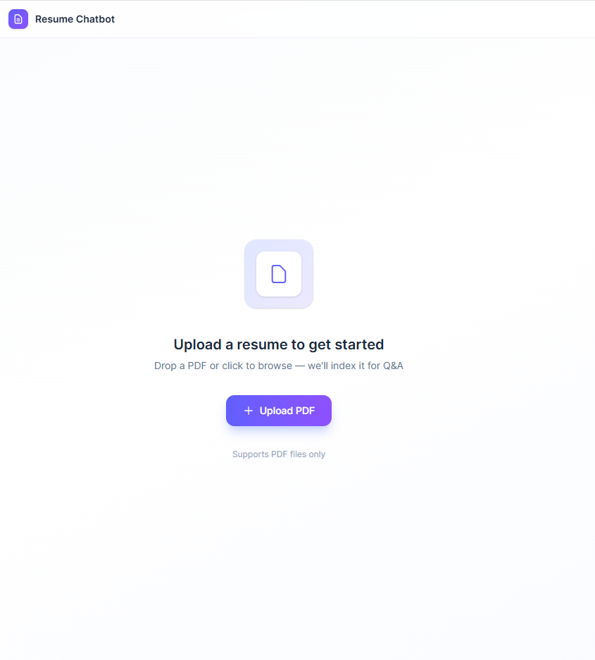
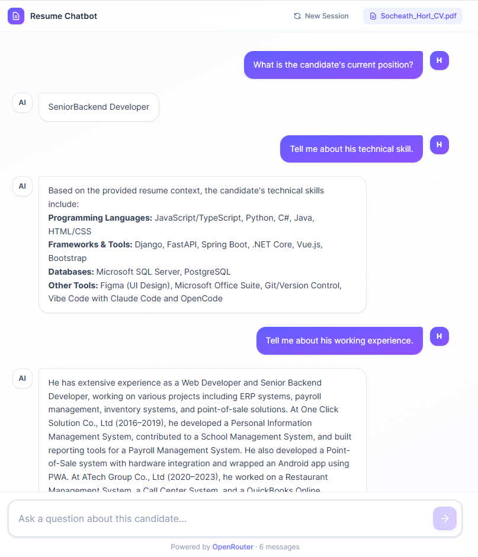

# Resume Chatbot

A 100% browser-based HR chatbot that lets you upload a candidate's resume (PDF) and ask questions about them using RAG. Built with Vue 3, TypeScript, LangChain.js, and Tailwind CSS v4.

## How it works

1. Upload a PDF resume
2. The text is extracted, split into chunks, and embedded on-device or via API
3. Ask natural language questions — the app retrieves relevant chunks and answers via an LLM

## Tech Stack

| Layer | |
|---|---|
| Frontend | Vue 3, TypeScript, Vite, Tailwind CSS v4 |
| RAG | LangChain.js |
| LLM | OpenRouter (free tier, configurable) |
| Embeddings | OpenRouter (OpenAI-compatible) or local via Transformers.js |
| Vector Store | In-memory (per session) |
| PDF Parsing | pdfjs-dist (in browser) |

## Prerequisites

- Node.js 18+
- An [OpenRouter](https://openrouter.ai) API key (free)

## Setup

```bash
cp .env.example .env
```

Edit `.env` with your OpenRouter API key:

```
VITE_OPENROUTER_API_KEY=sk-or-v1-...
VITE_OPENROUTER_BASE_URL=https://openrouter.ai/api/v1
VITE_LLM_MODEL=deepseek/deepseek-v4-flash:free
VITE_EMBEDDING_MODEL=text-embedding-3-small
VITE_CHUNK_SIZE=1000
VITE_CHUNK_OVERLAP=200
VITE_TOP_K=4
```

## Run

```bash
npm install
npm run dev
```

## Build

```bash
npm run build
npm run preview
```

## User Interface Demo

| Upload Screen | Chat Screen |
|---|---|
|  |  |

## Project Structure

```
src/
├── composables/
│   ├── useChat.ts        # RAG chain (retrieval + LLM)
│   └── useResume.ts      # PDF parse → chunk → embed → vector store
├── components/
│   ├── ResumeUploader.vue
│   └── ChatWindow.vue
├── types/
│   └── index.ts
├── App.vue
├── main.ts
└── style.css
```
